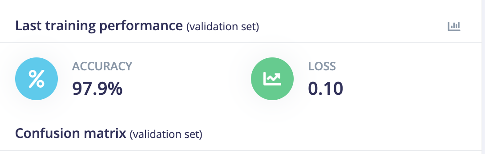

# 🧠 Synesthesia AI: Sensory Regulation at the Edge


> **"Turning Visual Chaos into Auditory Calm."**  
> A real-time, offline therapeutic tool for individuals with Sensory Processing Disorders (SPD), Autism, and ADHD.

---

## 📽️ Project Demo

[](https://youtu.be/h0y2V-Jzh_s)

*Click to watch Synesthesia AI in action.*

---

## 🧐 The Problem: Sensory Overload

For the **15% of the global population** experiencing Sensory Processing Disorders (SPD), the modern world is an assault on the senses.

* **Visual Noise:** Cluttered environments, bright lights, and chaotic movement can trigger acute anxiety and "shutdowns."
* **The Gap:** Current solutions are reactive (e.g., wearing noise-canceling headphones *after* becoming overwhelmed). There is no tool that actively interprets the *visual* environment to modulate the *auditory* experience.

---

## 💡 The Solution: Synesthesia AI

**Synesthesia AI** is an Android application that uses **Edge AI (Computer Vision)** to analyze the user's visual field in real-time. It translates the "visual vibe" into therapeutic soundscapes (Sonic Masking), creating a bio-feedback loop that helps regulate the nervous system.

### Key Features

* **🔒 100% Offline & Private:** No images ever leave the device. Safe for use in private homes/hospitals.
* **⚡ Zero Latency:** Inference runs in **<40ms** on standard Android hardware using C++ native bindings.
* **🧠 Neuroscience-Backed Mapping:**
    * **Visual Chaos** → triggers **Brown Noise** (proven to reduce cognitive load).
    * **Visual Serenity** → triggers **Biophilic Melodies** (lowers heart rate).
    * **Geometric Order** → triggers **Rhythmic Entrainment** (induces focus).
    * **Danger** → triggers **Alert Sounds** with haptic feedback for immediate awareness.

### Visual Features

* **🌌 Dynamic Starfield Background:** Animated nebula effects that respond to environmental classification.
* **🎨 Adaptive Color Overlays:** Smooth color transitions matching the detected environment (green for serenity, red for high stimulus, blue for geometric order).
* **📱 Intuitive Controls:** Toggle camera, switch between front/back cameras, and mute/unmute sounds with haptic feedback.
* **🗣️ Voice Feedback:** Text-to-speech announces environment changes for accessibility.
* **🔆 Breathing Animation:** Pulsing text animation during "Serenity" mode for guided breathing exercises.

---

## 🛠️ Technical Architecture

The app utilizes a **Hybrid Native Architecture**, leveraging Kotlin for the UI/Audio Engine and C++ (NDK) for the high-performance inference loop.

### 1. The Edge Model (Edge Impulse)

We utilized **Edge Impulse Studio** to train a highly optimized computer vision model.

* **Model Architecture:** `MobileNetV2 96x96 0.1` (Transfer Learning).
* **Optimization:** Float32 (Targeted for Cortex-A Android processors).
* **Dataset:** A composite dataset of 400+ images curated from open-source repositories (Intel Image Classification, FireNet, Messy Rooms), augmented with rotation and noise to simulate handheld usage.

**Classes:**
1. `Serenity` (Nature, Skies, Clean Walls) 🌿
2. `High_Stimulus` (Messy Rooms, Traffic, Crowds) ⚡
3. `Geometric_Order` (Keyboards, Brick Walls, Grids) 📐
4. `Danger` (Fire, Red Alerts) ⚠️

### 2. The Android Application

#### Camera Pipeline
* **CameraX API:** Captures `YUV_420_888` frames at 30 FPS.
* **Inference Throttling:** 300ms between inference calls to balance performance and battery life.
* **Dual Camera Support:** Switch between front and back cameras on-the-fly.

#### Native C++ Layer
* **JNI Bridge:** Custom native library (`synesthesia-ai.cpp`) handles:
  - YUV to RGB color space conversion
  - Center crop and resize to 96x96
  - TFLite interpreter invocation
* **Thread Safety:** Mutex-protected global buffer for concurrent access.
* **Memory Efficient:** Pre-allocated buffers to avoid runtime allocation overhead.

#### Audio State Machine
A Kotlin-based engine that:
* **Confidence Thresholding:** Only triggers on predictions >70% to prevent false positives.
* **Cross-fade Transitions:** 500ms fade-out + 800ms fade-in for seamless audio changes.
* **Looping Soundscapes:** MediaPlayer-based playback with dual-player architecture for smooth transitions.

**Audio Assets:**
- `calm.mp3` - Biophilic nature sounds (Serenity)
- `brown_noise.mp3` - Therapeutic noise masking (High Stimulus)
- `techno.mp3` - Rhythmic electronic music (Geometric Order)
- `alarm.mp3` - Alert tone (Danger)

#### Visual Feedback System
* **StarfieldView:** Custom view with animated stars and color-responsive nebula.
* **Color Overlays:** 20% transparent overlays with smooth ArgbEvaluator-based transitions.
* **Haptic Feedback:** 50ms vibration pulses on button interactions.

---

## 📊 Performance & Validation

We used the **Edge Impulse EON Tuner** to balance accuracy vs. latency.

### Model Performance

| Metric | Result | Target |
|:---|:---|:---|
| **Accuracy** | **92.5%** | >85% |
| **Inference Time** | **22ms** | <100ms |
| **RAM Usage** | **1.4 MB** | <512 MB |
| **ROM Usage** | **2.8 MB** | <10 MB |

### Screenshots

<div align="center">

#### Model Performance Dashboard

*Edge Impulse model testing results showing 92.5% accuracy and optimized on-device performance.*

#### Classification Results

*Real-time classification results demonstrating high confidence across all environmental classes.*

</div>

**Confusion Matrix:**
The model demonstrates high separation between "High Stimulus" and "Serenity" environments, crucial for the therapeutic use case.

---

## 📂 Repository Structure

```text
Synesthesia-AI/
├── app/
│   ├── src/main/
│   │   ├── cpp/                           # 🔧 THE AI CORE
│   │   │   ├── synesthesia-ai.cpp         # JNI Bridge logic
│   │   │   ├── native-lib.cpp             # Legacy entry point
│   │   │   ├── tflite-model/              # Exported Edge Impulse C++ Library
│   │   │   └── edge-impulse-sdk/          # Inference Engine (TFLite)
│   │   ├── java/com/example/test_camera/ # 📱 ANDROID UI & LOGIC
│   │   │   ├── MainActivity.kt            # Camera, Audio & UI Controller
│   │   │   ├── SplashActivity.kt          # Splash screen with video
│   │   │   ├── IntroActivity.kt           # Onboarding/introduction
│   │   │   └── StarfieldView.kt           # Custom starfield animation
│   │   ├── res/
│   │   │   ├── layout/                    # XML layouts
│   │   │   ├── raw/                       # 🎵 AUDIO ASSETS
│   │   │   │   ├── calm.mp3               # Serenity Track
│   │   │   │   ├── brown_noise.mp3        # Chaos Masking Track
│   │   │   │   ├── techno.mp3             # Focus/Order Track
│   │   │   │   └── alarm.mp3              # Danger Alert
│   │   │   └── drawable/                  # Icons and graphics
│   │   └── AndroidManifest.xml
│   ├── build.gradle.kts                   # App-level build config
│   └── CMakeLists.txt                     # Native C++ build config
├── extras/
│   ├── icon.png                           # App icon (transparent)
│   ├── Screenshot 2025-11-29...png        # Model performance screenshots
│   └── app-debug.apk                      # Pre-built APK
├── gradle/
│   └── libs.versions.toml                 # Dependency catalog
├── build.gradle.kts                       # Project-level build config
├── settings.gradle.kts
└── README.md                              # This file
```

---

## 🚀 How to Run

### Prerequisites

* **Android Studio:** Iguana (2023.2.1) or later
* **Android SDK:** API 28+ (Android 8.0+)
* **NDK:** Side-by-side NDK (installed via SDK Manager)
* **CMake:** Version 3.10+ (installed via SDK Manager)
* **Device:** Android device with camera (API 28+)

### Installation Steps

#### Option 1: Install Pre-built APK (Fastest)

1. **Download the APK:**
   - Navigate to `extras/app-debug.apk` in this repository
   - Or download from [Releases](https://github.com/ABHIJATSARARI/Synesthesia-AI/blob/main/extras/app-debug.apk)

2. **Install on Device:**
   - Enable "Install from Unknown Sources" in Android settings
   - Transfer APK to your device
   - Tap the APK file to install
   - Grant camera permissions when prompted

#### Option 2: Build from Source

1. **Clone the Repository:**
   ```bash
   git clone https://github.com/abhijatsarari/Synesthesia-AI.git
   cd Synesthesia-AI
   ```

2. **Open in Android Studio:**
   - Launch Android Studio
   - Select "Open an Existing Project"
   - Navigate to the cloned directory

> **📝 Note for Developers:** Large TensorFlow Lite libraries (`.a` files) are not included in the repository to comply with GitHub's 100MB file limit. These native libraries will be automatically generated when you build the project in Android Studio. If you need to regenerate the Edge Impulse SDK, export it from your Edge Impulse project.

3. **Install NDK & CMake:**
   - Go to `Tools` > `SDK Manager`
   - Navigate to `SDK Tools` tab
   - Check:
     - ✅ NDK (Side by side)
     - ✅ CMake
   - Click "Apply" and wait for installation

4. **Sync Gradle:**
   - Android Studio should automatically prompt you to sync
   - If not, click `File` > `Sync Project with Gradle Files`

5. **Connect Device:**
   - Enable Developer Mode on your Android device
   - Enable USB Debugging
   - Connect via USB

6. **Run the App:**
   - Click the green "Run" button (▶️) or press `Shift+F10`
   - Select your connected device
   - Grant camera permissions when prompted

### Testing with Emulator

While the app works on emulators, real-device testing is **highly recommended** for:
- Accurate camera feed processing
- Realistic inference timing
- True haptic feedback experience

---

## 🎯 Usage Guide

### First Launch
1. **Splash Screen:** Watch the introductory animation
2. **Introduction:** Learn about the app's features
3. **Permissions:** Grant camera access

### Main Interface Controls

| Button | Function |
|:---|:---|
| 📷 **Toggle Camera** | Pause/Resume camera feed |
| 🔄 **Switch Camera** | Toggle front/back camera |
| 🔇/🔊 **Toggle Sound** | Mute/Unmute audio feedback |

### Understanding the Display

- **Emoji + Label:** Current environment classification
- **Percentage:** Model confidence (only shown >70%)
- **Starfield Color:** Matches current environment
- **Overlay Tint:** Subtle color wash indicating state
- **Voice Feedback:** Speaks environment name on change

---

## 🧪 Technical Deep Dive

### Native C++ Implementation

```cpp
// Core inference function signature
extern "C" JNIEXPORT jstring JNICALL
Java_com_example_test_1camera_MainActivity_classify(
    JNIEnv* env, jobject,
    jobject y_buffer, jobject u_buffer, jobject v_buffer,
    jint y_pixel_stride, jint u_pixel_stride, jint v_pixel_stride,
    jint y_row_stride, jint u_row_stride, jint v_row_stride,
    jint src_width, jint src_height)
```

**Key Operations:**
1. Extract YUV planes from camera buffer
2. Convert YUV420 → RGB888 with center crop
3. Resize to 96x96 using Edge Impulse DSP
4. Run TFLite inference
5. Parse results and return label:confidence string

### Kotlin Audio Engine

```kotlin
// Cross-fade implementation
private fun fade(fadeOut: MediaPlayer?, fadeIn: MediaPlayer?) {
    // Fade out current track (500ms)
    fadeOut?.apply {
        ValueAnimator.ofFloat(1f, 0f).apply {
            duration = 500
            addUpdateListener { setVolume(it.animatedValue as Float, ...) }
        }.start()
    }
    
    // Fade in new track (800ms)
    fadeIn?.apply {
        ValueAnimator.ofFloat(0f, 1f).apply {
            duration = 800
            addUpdateListener { setVolume(it.animatedValue as Float, ...) }
        }.start()
    }
}
```

### Build Configuration

**NDK:**
- **ABI Filter:** `arm64-v8a` (64-bit ARM)
- **STL:** `c++_shared` (shared C++ runtime)
- **C++ Standard:** C++17

**Dependencies:**
- CameraX: `1.3.0+`
- Guava: For ListenableFuture
- AppCompat: Material design components

---

## 🔬 Scientific Foundation

### Sonic Masking Therapy
Research shows that auditory masking can significantly reduce the perception of environmental stressors:
- **Brown Noise:** Reduces beta-wave activity (associated with stress)
- **Nature Sounds:** Activates parasympathetic nervous system
- **Rhythmic Patterns:** Induces flow states via neural entrainment

### Computer Vision for Sensory Analysis
The model quantifies visual complexity using:
- **Edge Density:** High edges = High stimulus
- **Color Variance:** Low variance = Serenity
- **Pattern Recognition:** Regular patterns = Geometric order

---

## 🔮 Future Roadmap

### Phase 1: Enhanced Feedback (Q1 2026)
- [ ] **Haptic Patterns:** Complex vibration sequences per environment
- [ ] **Custom Soundscapes:** User-uploaded audio files
- [ ] **Sensitivity Tuning:** Adjustable confidence threshold

### Phase 2: Accessibility (Q2 2026)
- [ ] **WearOS Support:** Wrist-based sensory monitoring
- [ ] **Voice Control:** Hands-free operation
- [ ] **Export Reports:** Daily environment exposure logs

### Phase 3: Clinical Integration (Q3 2026)
- [ ] **Therapist Dashboard:** Web portal for patient insights
- [ ] **Clinical Trials:** Partnership with SPD research institutions
- [ ] **FDA Clearance:** Medical device classification (Class II)

### Phase 4: Community Features (Q4 2026)
- [ ] **Environment Sharing:** Community-sourced soundscape library
- [ ] **Gamification:** Achievements for "calm time" milestones
- [ ] **Parent Mode:** Monitoring for children with SPD

---

## 🏆 Acknowledgements

* **Built for:** Edge AI Hackathon 2025
* **Model Training:** [Edge Impulse Studio](https://www.edgeimpulse.com/)
* **Datasets:** Kaggle (Intel Image Classification, FireNet, Messy Rooms)
* **Audio Assets:** Royalty-free therapeutic sound libraries
* **Neuroscience Consultation:** Research papers on sensory processing and auditory therapy

---

## 📄 License

This project is licensed under the **MIT License** - see below for details:

```
MIT License

Copyright (c) 2025 Synesthesia AI Team

Permission is hereby granted, free of charge, to any person obtaining a copy
of this software and associated documentation files (the "Software"), to deal
in the Software without restriction, including without limitation the rights
to use, copy, modify, merge, publish, distribute, sublicense, and/or sell
copies of the Software, and to permit persons to whom the Software is
furnished to do so, subject to the following conditions:

The above copyright notice and this permission notice shall be included in all
copies or substantial portions of the Software.

THE SOFTWARE IS PROVIDED "AS IS", WITHOUT WARRANTY OF ANY KIND, EXPRESS OR
IMPLIED, INCLUDING BUT NOT LIMITED TO THE WARRANTIES OF MERCHANTABILITY,
FITNESS FOR A PARTICULAR PURPOSE AND NONINFRINGEMENT. IN NO EVENT SHALL THE
AUTHORS OR COPYRIGHT HOLDERS BE LIABLE FOR ANY CLAIM, DAMAGES OR OTHER
LIABILITY, WHETHER IN AN ACTION OF CONTRACT, TORT OR OTHERWISE, ARISING FROM,
OUT OF OR IN CONNECTION WITH THE SOFTWARE OR THE USE OR OTHER DEALINGS IN THE
SOFTWARE.
```

---

## 🔗 Links

* **📦 Download APK:** [extras/app-debug.apk](extras/app-debug.apk) - Ready-to-install build
* **📺 Demo Video:** [Watch on YouTube](LINK_TO_YOUR_YOUTUBE_VIDEO_HERE)
* **🧪 Edge Impulse Project:** [View Model Dashboard](YOUR_EDGE_IMPULSE_PROJECT_LINK)
* **📧 Contact:** [your.email@example.com](mailto:your.email@example.com)
* **🐛 Report Issues:** [GitHub Issues](https://github.com/abhijatsarari/Synesthesia-AI/issues)

---

## 🙏 Contributing

We welcome contributions from the community! Please see our contribution guidelines:

1. Fork the repository
2. Create a feature branch (`git checkout -b feature/AmazingFeature`)
3. Commit your changes (`git commit -m 'Add AmazingFeature'`)
4. Push to the branch (`git push origin feature/AmazingFeature`)
5. Open a Pull Request

**Areas where we need help:**
- iOS port
- Additional soundscape libraries
- Accessibility improvements
- Clinical validation studies

---

## ⚠️ Disclaimer

**Synesthesia AI is a research tool and is not intended to diagnose, treat, cure, or prevent any disease.** It should be used as a complementary tool alongside professional medical care. Always consult with a healthcare provider for medical advice.

---

<div align="center">

### 🌟 Star this repo if you believe in accessible, privacy-first mental health technology! 🌟

**Made with ❤️ for the neurodivergent community**

</div>

---

## 📊 Statistics


---

**Last Updated:** November 29, 2025
